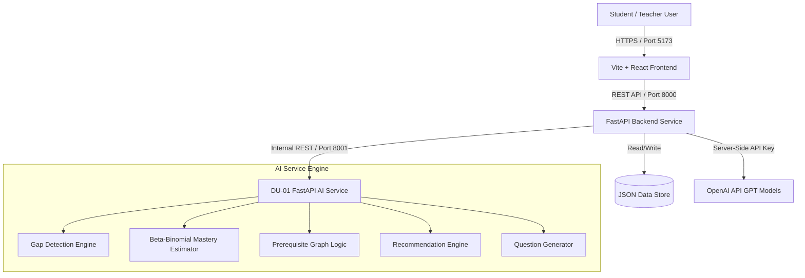

# Titans — AI-Powered Learning Gap Detector

> "From marks to diagnosis — identify the concept behind the mistake."

---

## 1. Project Overview

Titans is an intelligent educational platform designed to transform assessment evaluation from simple numerical grading into actionable, concept-level diagnostic insights. Developed for hackathons and modern educational workflows, Titans analyzes student assessment responses, maps underlying conceptual weaknesses, estimates concept mastery, and generates tailored remediation strategies and practice questions.

---

## 2. Problem Statement

Traditional educational assessments primarily provide overall marks or letter grades (e.g., 65%). However, a single score fails to explain why a student missed specific questions or which prerequisite concepts caused the failure. For instance, a student struggling with recursion might actually have a fundamental gap in understanding stack frames or function returns. Traditional approaches offer generic study advice without identifying root causes.

---

## 3. Our Solution

Titans shifts assessment paradigm from:

`Assessment → Marks → Generic Feedback`

to:

`Assessment → Response Analysis → Concept-Level Diagnosis → Mastery Estimation → Prerequisite Analysis → Confidence & Severity → Personalized Recommendations → Targeted Practice → Reassessment`

By analyzing item-level responses against a concept dependency graph, Titans delivers precise diagnostic reports for students and aggregate class heatmaps for teachers.

---

## 4. Why This Is Different

| Generic Assessment | Titans AI Learning Gap Detector |
| :--- | :--- |
| Overall score only | Concept-level mastery diagnosis |
| Right/Wrong binary feedback | Evidence-backed error diagnosis |
| Generic study advice | Actionable, prioritized recommendations |
| Isolated topics | Prerequisite dependency graph reasoning |
| Static question banks | Targeted & adaptive question generation |
| No uncertainty measurement | Evidence-based confidence scoring |
| One-way assessment | Continuous diagnostic & practice loop |

---

## 5. Key Features

- **Concept-Level Diagnosis:** Maps assessment responses directly to 7 core Computer Science concepts (`Variables`, `Loops`, `Functions`, `Stack Frames`, `Recursion`, `Memoization`, `Dynamic Programming`).
- **Bayesian Mastery Estimation:** Utilizes Beta-Binomial update rules ($\text{Mastery} = \frac{\alpha}{\alpha + \beta}$) to quantify concept proficiency based on response correctness and hint usage.
- **Prerequisite Graph Reasoning:** Identifies root-cause weaknesses when performance in advanced topics (e.g., Recursion) is hindered by gaps in fundamental topics (e.g., Stack Frames).
- **Severity & Confidence Scoring:** Categorizes gaps into `critical`, `high`, `medium`, and `low` severities, paired with confidence bounds derived from evidence density.
- **Personalized Recommendations:** Generates individualized remediation plans (scaffolded bridges, deep dives, targeted practice, peer tutoring, or stretch challenges).
- **Teacher Dashboard & Class Heatmap:** Provides educators with real-time class averages, top class-wide gaps, subject switching, student management, and AI question generation.
- **Adaptive Practice Generator:** Generates customizable MCQ and short-answer questions tailored by concept and difficulty.

---

## 6. How It Works

1. **Response Evaluation:** Student submissions are evaluated for accuracy, partial correctness, and hint usage.
2. **Mastery Calculation:** Response scores update Bayesian alpha ($\alpha$) and beta ($\beta$) parameters for each targeted concept.
3. **Graph Traversal:** The prerequisite engine checks if lower mastery in prerequisite nodes degrades higher-level concept confidence.
4. **Diagnosis Generation:** Gaps are classified by severity and confidence.
5. **Remediation Synthesis:** The recommendation engine builds an ordered action plan personalized to the student.

---

## 7. System Architecture



---

## 8. Complete Data Flow

```text
Question Data + Student Responses
       ↓
FastAPI Backend (/api/reports/students/{id})
       ↓
DU-01 AI Service (/detect-gaps)
       ↓
Response Scoring & Evidence Aggregation
       ↓
Beta-Binomial Mastery Update: Alpha / (Alpha + Beta)
       ↓
Prerequisite Graph Analysis (Recursion -> Functions & Stack Frames)
       ↓
Gap Categorization (Severity + Confidence)
       ↓
Recommendation Generation (/recommend)
       ↓
Frontend Visualizations (Radar Chart, Heatmaps, Action Plans)
       ↓
Targeted Practice Loop (/generate-practice)
```

---

## 9. AI / Learning Gap Detection

The diagnostic engine uses a Bayesian Beta-Binomial updating formula. For each concept $c$:
- Initial prior: $\alpha = 2.0$, $\beta = 2.0$
- Evidence update per question score $s \in [0.0, 1.0]$:
  $$\alpha \leftarrow \alpha + 2s$$
  $$\beta \leftarrow \beta + 2(1 - s)$$
- Estimated Mastery:
  $$\text{Mastery} = \frac{\alpha}{\alpha + \beta}$$

---

## 10. Prerequisite / Knowledge Graph Logic

The knowledge graph defines directed dependencies between concepts:
- `Recursion` $\rightarrow$ `Functions`, `Stack Frames`
- `Dynamic Programming` $\rightarrow$ `Recursion`, `Memoization`

If a prerequisite concept mastery falls below $0.6$, dependent concept mastery estimates are scaled down, triggering scaffolded "Bridge" recommendations.

---

## 11. Confidence and Severity

- **Confidence Score:** Derived from evidence count ($n_{\text{ev}} = \alpha + \beta - 4$):
  $$\text{Confidence} = \min(0.95, 0.40 + 0.08 \times n_{\text{ev}})$$
- **Severity Classification:**
  - Critical: Mastery $< 0.35$
  - High: $0.35 \le \text{Mastery} < 0.55$
  - Medium: $0.55 \le \text{Mastery} < 0.75$
  - Low: Mastery $\ge 0.75$

---

## 12. Personalized Recommendations

Recommendations are generated dynamically per student:
- **Scaffolded Bridge:** Triggered when prerequisite gaps exist.
- **Deep Dive:** Triggered for critical or high severity gaps.
- **Targeted Practice:** Generated for concept reinforcement.
- **Peer Tutoring:** Suggested for high-confidence critical gaps.
- **Stretch Challenges:** Generated for students with zero learning gaps.

---

## 13. Adaptive Practice Generation

Teachers can generate custom practice sets by concept and difficulty (Easy, Medium, Hard). The backend communicates with OpenAI models using server-side keys to produce formatted MCQ and short-answer items.

---

## 14. Technology Stack

- **Frontend:** React 18, TypeScript, Vite, Tailwind CSS, Recharts, Lucide Icons.
- **Backend:** Python 3.10+, FastAPI, Uvicorn, Pydantic, HTTPX.
- **AI Service:** FastAPI, Uvicorn, Python Data Science libraries.
- **Orchestration:** PowerShell scripts (`setup-all.ps1`, `start-all.ps1`).

---

## 15. Project Structure

```text
du01-gap-detector/
├── README.md
├── setup-all.ps1
├── start-all.ps1
├── .env.example
├── ai/
│   ├── main.py
│   ├── schemas.py
│   ├── requirements.txt
│   ├── logic/
│   │   ├── gap_detector.py
│   │   ├── calibration.py
│   │   ├── graph.py
│   │   ├── recommender.py
│   │   └── question_gen.py
│   └── tests/
│       └── test_logic.py
├── backend/
│   ├── requirements.txt
│   ├── seed-more-questions.ps1
│   ├── app/
│   │   ├── main.py
│   │   ├── db.py
│   │   ├── schemas.py
│   │   ├── routes/
│   │   │   ├── students.py
│   │   │   ├── classes.py
│   │   │   ├── questions.py
│   │   │   ├── practice.py
│   │   │   ├── responses.py
│   │   │   └── reports.py
│   │   └── services/
│   │       ├── ai_client.py
│   │       └── analysis.py
│   └── data/
│       ├── classes.json
│       ├── students.json
│       ├── questions.json
│       └── responses.json
└── frontend/
    ├── package.json
    ├── vite.config.ts
    └── src/
        ├── App.tsx
        ├── auth.ts
        ├── api.ts
        ├── types.ts
        ├── components/
        └── pages/
            ├── Login.tsx
            ├── SubjectSelect.tsx
            ├── TeacherDashboard.tsx
            ├── StudentReport.tsx
            └── PracticePlayer.tsx
```

---

## 16. API Documentation

### Backend APIs (`http://127.0.0.1:8000`)
- `GET /api/subjects`: Returns list of available subjects and concepts.
- `GET /api/classes/{id}/dashboard`: Returns class heatmap and summary statistics.
- `POST /api/students`: Adds a new student (`{ name, class_id }`).
- `GET /api/students/{id}/report`: Returns student gap diagnostic report.
- `POST /api/questions/generate`: Generates questions via AI (`{ subject, concept, count, difficulty }`).
- `POST /api/questions`: Saves generated question sets.

### AI Service APIs (`http://127.0.0.1:8001`)
- `GET /health`: Healthcheck endpoint.
- `POST /detect-gaps`: Computes gap diagnosis from student responses.
- `POST /recommend`: Generates personalized recommendations.
- `POST /generate-practice`: Generates template-based practice sets.

---

## 17. Prerequisites

- Python 3.10+
- Node.js 18+ & npm
- PowerShell (Windows 10/11)

---

## 18. Installation

Clone the repository and run the setup script:

```powershell
git clone https://github.com/itss-meS/Titans.git
cd Titans/du01-gap-detector
.\setup-all.ps1
```

---

## 19. Running the Application

To launch all three services simultaneously (Frontend, Backend, AI Service):

```powershell
.\start-all.ps1
```

Access points:
- **Frontend Dashboard:** `http://127.0.0.1:5173`
- **Backend API Docs:** `http://127.0.0.1:8000/docs`
- **AI Service Docs:** `http://127.0.0.1:8001/docs`

---

## 20. Running Services Separately

### AI Service (Port 8001)
```powershell
cd ai
.\start-ai.ps1
```

### Backend Service (Port 8000)
```powershell
cd backend
.\start-backend.ps1
```

### Frontend (Port 5173)
```powershell
cd frontend
.\start-frontend.ps1
```

---

## 21. Testing

Run AI service test suite:

```powershell
cd ai
$env:PYTHONPATH="."
python tests/test_logic.py
```

Run Frontend type checks and build:

```powershell
cd frontend
npx tsc --noEmit
npm run build
```

---

## 22. Example Workflow

1. Teacher logs in and selects a subject (e.g., `Programming (CS101)`).
2. Teacher views class heatmap showing student mastery across 7 concepts.
3. Teacher adds a new student or generates AI question sets.
4. Student logs in to view their personalized report.
5. Student sees overall mastery, radar chart, top focus areas, and recommended practice.
6. Student completes adaptive practice session and receives instant feedback.

---

## 23. Example Learning Gap Report

```json
{
  "student_id": "stu_1",
  "student_name": "Aarav Patil",
  "overall_mastery": 0.66,
  "status": "ok",
  "gaps": [
    {
      "concept": "Dynamic Programming",
      "severity": "critical",
      "confidence": 0.56,
      "mastery": 0.33,
      "prerequisite_gaps": ["Recursion"]
    }
  ],
  "recommendations": [
    {
      "priority": 1,
      "type": "scaffolded",
      "title": "Bridge: Recursion to Dynamic Programming",
      "description": "Strengthen foundation concept Recursion before tackling Dynamic Programming."
    }
  ]
}
```

---

## 24. Configuration / Environment Variables

Create `.env` at the root directory:

```ini
OPENAI_API_KEY=your_openai_api_key_here
LLM_MODEL=gpt-4o-mini
```

---

## 25. Troubleshooting

- **PowerShell Script Policy:** Run `Set-ExecutionPolicy -Scope Process -ExecutionPolicy Bypass` if script execution is blocked.
- **Port Conflicts:** Ensure ports `5173`, `8000`, and `8001` are not in use by other applications.
- **Missing AI Key:** If `OPENAI_API_KEY` is not set, question generation returns a `503 AI service unavailable` error while deterministic gap detection remains fully functional.

---

## 26. Security Notes

- API keys are strictly server-side and never exposed to the frontend or browser `localStorage`.
- Environment variables are isolated and excluded from version control via `.gitignore`.

---

## 27. Future Enhancements

- Expanded knowledge graphs covering additional domains.
- Longitudinal student progress tracking.
- Semantic short-answer grading using fine-tuned embeddings.
- Multi-teacher & multi-class administration portal.

---

## 28. Team

Developed by Team Titans (Shrey, Sanskar, Vardhan, Parth).

---

## 29. Hackathon Context

DU-01 — AI-Powered Learning Gap Detector  
Domain: Education & Technology

---

## 30. License

MIT License. See [LICENSE](LICENSE) for details.